# engineering-core

[](https://github.com/aydinogluomer-sys/engineering-core/actions/workflows/validate.yml)


## Engineering orchestration for Claude Code

`engineering-core` is a repository-agnostic engineering operating system for Claude Code.

It does more than tell an agent how to write code.

It gives substantial engineering work a disciplined execution model for:

**risk classification → repository investigation → requirement compilation → bounded implementation → independent QA → specialist review → evidence-based phase closure → cross-session continuity → fresh release audit**

Small changes stay small.

Normal engineering work gets proportionate investigation and verification.

Large `implementation.md` specifications can escalate into a structured engineering-team workflow with explicit ownership, requirement traceability, independent evidence, and release gates.

> **The objective is not maximum process.
> The objective is the minimum engineering ceremony required by the consequence and uncertainty of the task.**

---

## At a glance

| Capability                    | What `engineering-core` does                                                                                                 |
| ----------------------------- | ---------------------------------------------------------------------------------------------------------------------------- |
| **Adaptive Fast-Exit**        | Keeps genuinely Low-risk local work fast                                                                                     |
| **Standard Engineering Mode** | Handles normal implementation, debugging, refactoring, migration, review, and release preparation                            |
| **Formal Spec Team Mode**     | Executes large or consequential `implementation.md` contracts as an engineering organization                                 |
| **Spec Compiler**             | Converts long specifications into traceable sections, requirements, acceptance criteria, locks, dependencies, and work units |
| **Independent QA**            | Prevents builders from defining their own correctness                                                                        |
| **Conditional Specialists**   | Escalates security, database, frontend/browser, or performance work only when relevant                                       |
| **Finding Ledger**            | Tracks review findings through evidence-backed resolution                                                                    |
| **Two-Key Phase Closure**     | Prevents Moderate/High/Critical phases from being self-certified by the builder                                              |
| **Cross-Session State**       | Preserves only continuation-critical evidence across compaction or new sessions                                              |
| **Fresh Release Auditor**     | Separates local phase success from actual release verification                                                               |
| **Evidence Ladder**           | Separates structural proof, policy lint, adversarial traces, live Claude behavior, and real-world field evidence             |
| **Optional integrations**     | Can use code graphs, hooks, observability, or specialist skills without depending on them                                    |

---

# Why this exists

Coding agents commonly fail in two opposite directions.

They can **under-engineer consequential work**:

```text
"Only one line changed."
        ↓
Treat as trivial.
        ↓
Miss auth / billing / schema / production consequences.
```

Or they can **over-engineer trivial work**:

```text
"Fix this local typo."
        ↓
Broad repository scan.
        ↓
Large plan.
        ↓
Multiple agents.
        ↓
Full test suite.
```

Large implementation plans introduce another class of failures:

```text
implementation.md
        ↓
Agent starts coding immediately
        ↓
Requirement omitted
        ↓
Builder writes its own tests
        ↓
Builder declares itself complete
        ↓
Later phase changes earlier assumptions
        ↓
Old evidence remains "green"
        ↓
Release declared ready
```

`engineering-core` is designed specifically to resist those failure modes.

---

# The runtime architecture

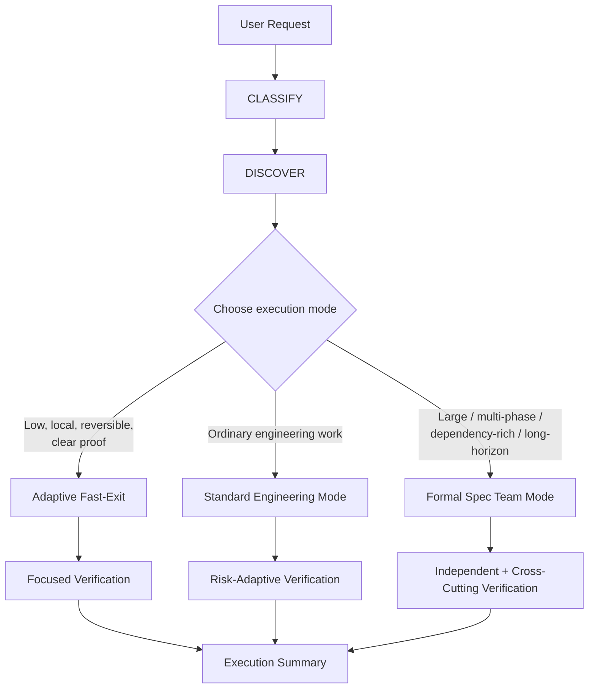

The dispatcher begins with evidence, not diff size.

A one-line authorization change may be **High**.

A one-file typo may remain **Low**.

A formal document does not automatically require Team Mode.

---

# Three execution modes

## 1. Adaptive Fast-Exit

For work that is genuinely:

```text
Low risk
+
local
+
reversible
+
unambiguous
+
supported by a clear local precedent
+
provable through a narrow focused check
```

Fast-Exit compresses investigation and planning.

It does **not** remove:

```text
repository instructions
scope control
verification
final diff review
evidence-based completion
```

### Fast-Exit architecture

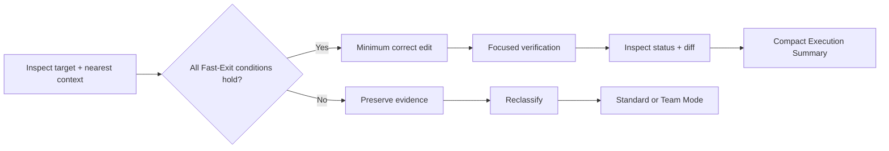

### Fast-Exit abort conditions

Fast-Exit immediately stops when evidence reveals:

```text
shared/public contract
dependency consequence
uncertain root cause
unexpected verification result
scope expansion
auth / RLS / tenant boundary
billing / payment behavior
production consequence
schema/data consequence
secret handling
irreversible side effect
```

The goal is not fewer tool calls.

The goal is **minimum sufficient engineering work**.

---

## 2. Standard Engineering Mode

Most engineering work belongs here.

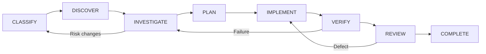

The lifecycle is deliberately reversible.

Verification failure does not mean “try another random patch”.

It means classify the failure, update the hypothesis, and move backward deliberately.

---

## 3. Formal Spec Team Mode

Formal Spec Team Mode is the largest differentiator in `engineering-core`.

It is intended for work such as:

```text
large implementation.md
multi-phase hardening
dependency-rich migrations
security-sensitive programs
multiple engineering domains
long-horizon implementation
phase/release gated work
work likely to survive context compaction or session boundaries
```

It is **not** triggered merely because an `implementation.md` file exists.

A small, tightly coupled formal contract may remain in Standard Engineering Mode.

---

# Formal Spec Team Mode

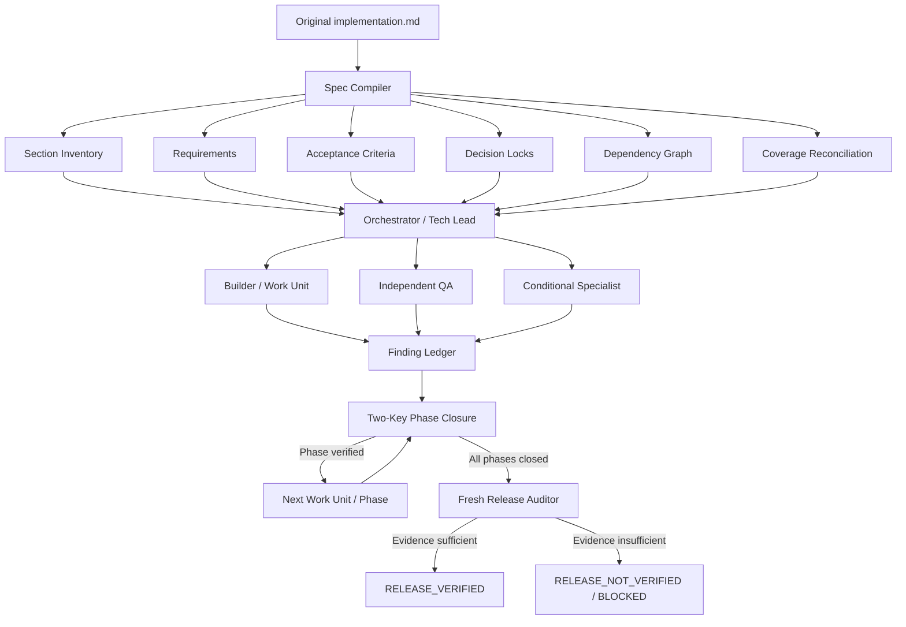

This is orchestration discipline, not agent-count theater.

---

# Spec Compiler

The first responsibility in a large formal specification is **not coding**.

It is loss-resistant specification compilation.

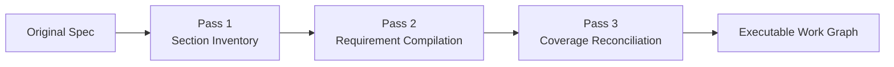

## Pass 1 — Section Inventory

Every meaningful source section receives a classification:

```text
requirement
acceptance criterion
Decision Lock
constraint
background / rationale
suggestion
deferral
release gate
verification instruction
unknown / ambiguous
```

No section may silently disappear.

---

## Pass 2 — Requirement Compilation

Executable requirements become stable work items:

```text
REQ-001
REQ-002
REQ-003
...
```

Each requirement can carry:

```text
source
acceptance criteria
constraints
Decision Locks
dependencies
affected surfaces
risk
specialist need
verification evidence
current state
```

---

## Pass 3 — Coverage Reconciliation

Before implementation begins:

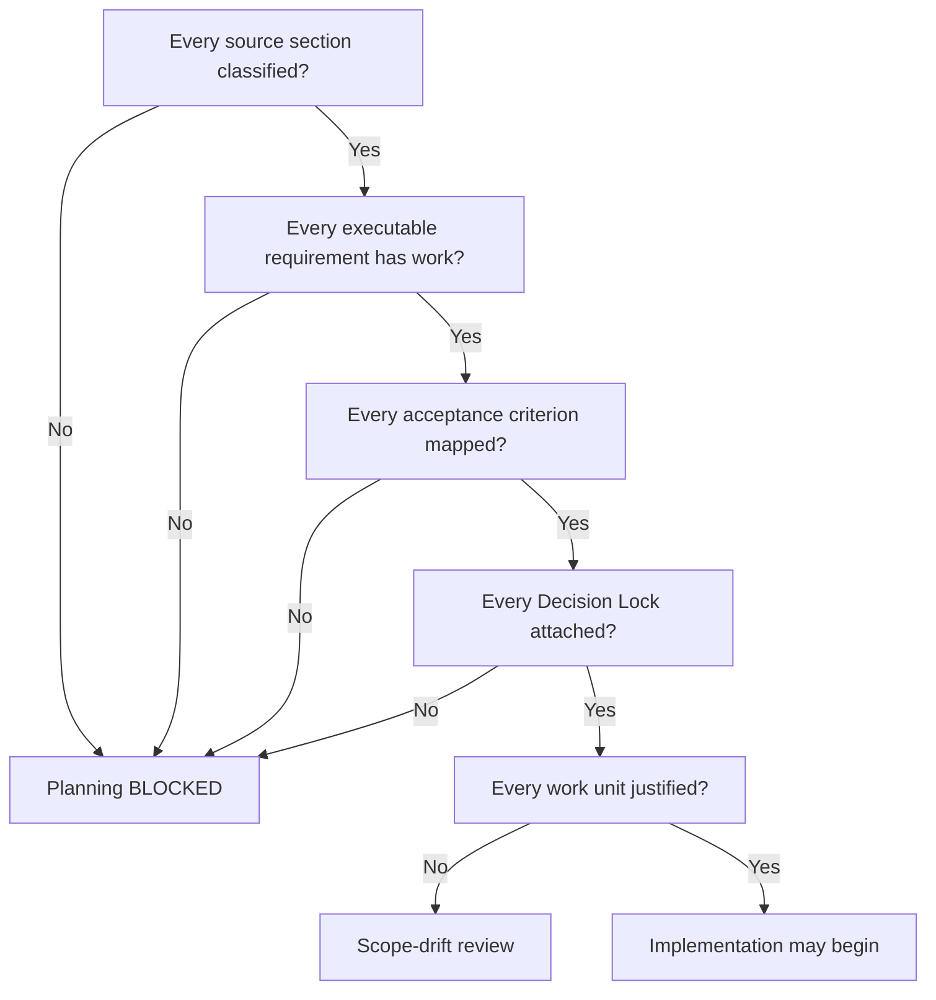

This protects against a dangerous class of failure:

> perfectly implementing an incomplete interpretation of the specification.

---

# Requirement Coverage Matrix

Formal Spec Team Mode keeps requirement traceability explicit.

| Requirement | Source | Work Unit | Implementation | Evidence   | Independent Review | Status   |
| ----------- | ------ | --------- | -------------- | ---------- | ------------------ | -------- |
| `REQ-001`   | §2.1   | `WORK-01` | `auth.ts`      | auth tests | QA                 | VERIFIED |
| `REQ-002`   | §2.4   | `WORK-02` | migration      | role probe | DB specialist      | VERIFIED |
| `REQ-003`   | §3.2   | `WORK-03` | —              | —          | —                  | BLOCKED  |

Two important audits follow from this.

### Orphan requirement

```text
Requirement exists
but
no implementation / disposition / evidence plan
```

Result:

```text
phase or release closure blocked
```

### Orphan change

```text
Meaningful code change exists
but
no requirement / correctness justification
```

Result:

```text
scope-drift review
```

---

# Orchestrator / Tech Lead

The orchestrator owns coordination, not truth by proclamation.

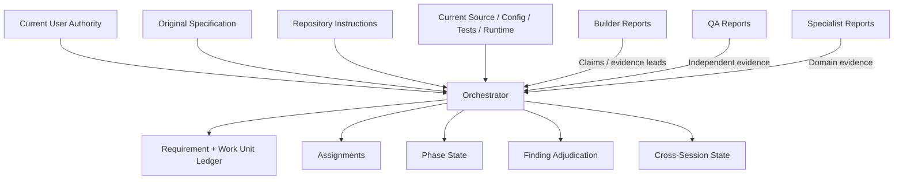

Authority is ordered:

```text
current explicit user instruction
        ↓
original formal specification
        ↓
applicable repository instructions
        ↓
current source / config / test / runtime evidence
        ↓
derived requirement/work-unit state
        ↓
agent reports
```

A subagent saying “done” is never enough.

---

# Work Units and bounded ownership

Every non-trivial Team Mode unit defines:

```text
WORK-ID
requirement IDs
objective
dependencies
allowed files/surfaces
one active writer
write authority
forbidden changes
expected artifacts
required verification
risk
specialist requirement
status
evidence
stop conditions
```

## One-writer rule

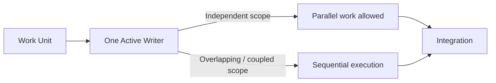

Parallelism is allowed only when it improves throughput without sacrificing ownership clarity.

Maximum agent count is not a quality metric.

---

# Independent QA

Builders should not define their own correctness.

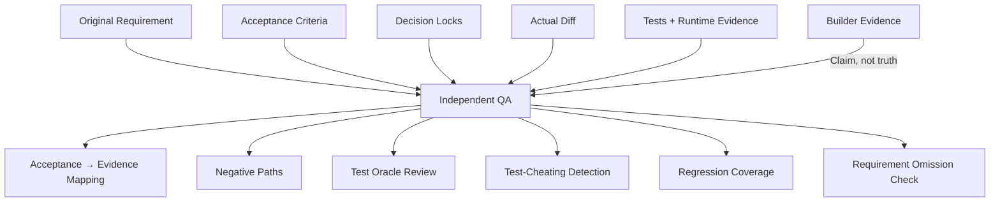

For High/Critical work, expected behavior and negative paths should be derived before or independently from the final implementation whenever practical.

---

# Conditional specialists

Specialists are loaded only when the engineering surface justifies them.

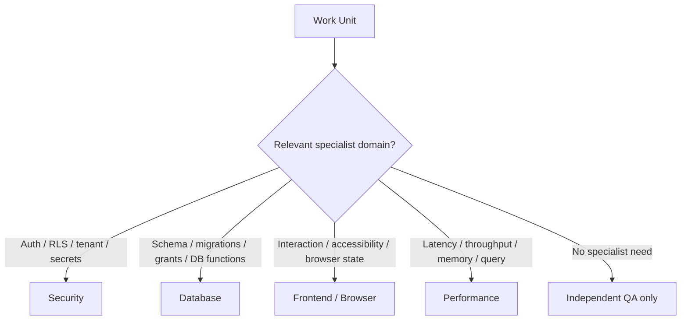

The specialist owns domain mechanics.

`engineering-core` still owns:

```text
scope
authorization
evidence
user-work safety
verification
completion semantics
Decision Locks
```

---

# Finding Ledger

Review findings are not allowed to disappear informally.

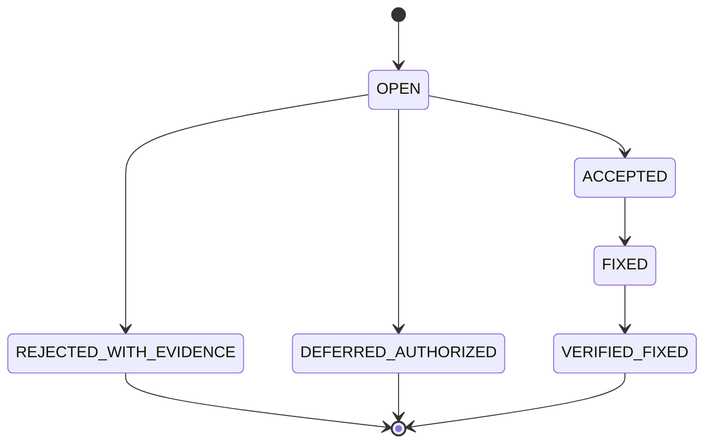

Allowed states:

```text
OPEN
ACCEPTED
FIXED
VERIFIED_FIXED
REJECTED_WITH_EVIDENCE
DEFERRED_AUTHORIZED
```

Plain `REJECTED` is intentionally insufficient.

A finding can be rejected only with evidence.

---

# Two-Key Phase Closure

Moderate, High, and Critical Team Mode phases cannot be self-certified.

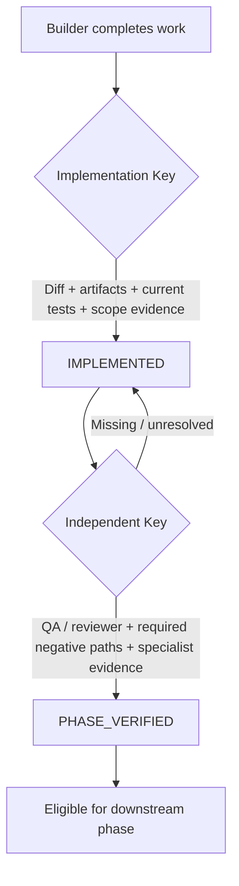

The two keys are:

### Key 1 — Implementation evidence

```text
intended artifacts exist
required current tests pass
forbidden scope absent
builder evidence maps to requirements
```

### Key 2 — Independent evidence

```text
QA acceptance mapping passes
required negative paths pass
required specialist findings resolved
```

Therefore:

```text
IMPLEMENTED != VERIFIED
```

and:

```text
PHASE_VERIFIED != RELEASE_VERIFIED
```

---

# Requirement changes during execution

Large plans change.

`engineering-core` does not respond by throwing away all verified work.

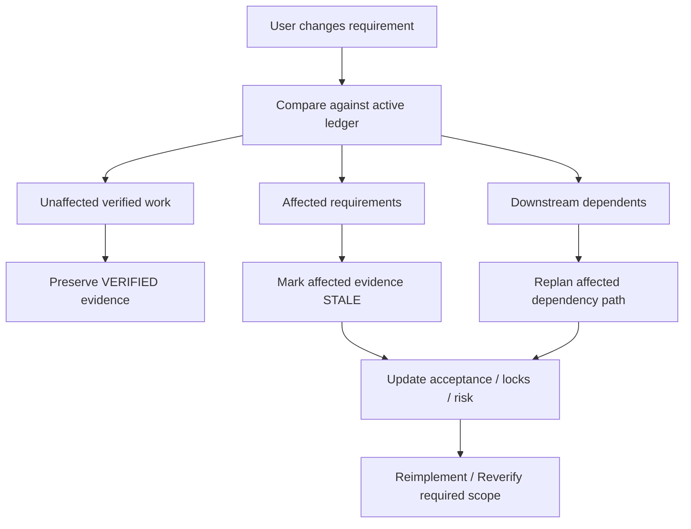

The principle is selective invalidation.

Example:

```text
Phase A → VERIFIED → remains VERIFIED
Phase B / REQ-12 → changed → STALE
Phase D → depends on REQ-12 → replanned
Unrelated Phase C → preserved
```

---

# Cross-session continuity

Long-running engineering work must survive context compaction and fresh sessions without trusting stale notes.

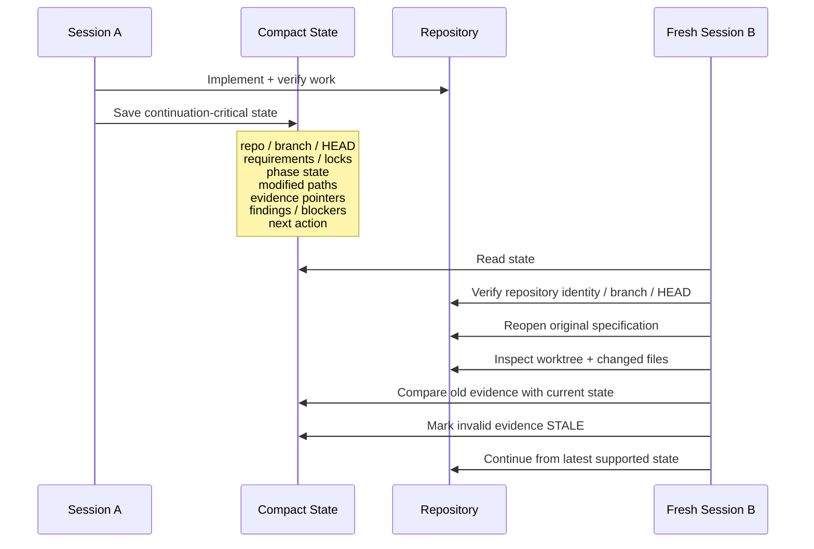

A note saying:

```text
tests passed
```

is not current evidence after relevant edits.

---

# Fresh Release Auditor

Local phase success is not the same as release readiness.

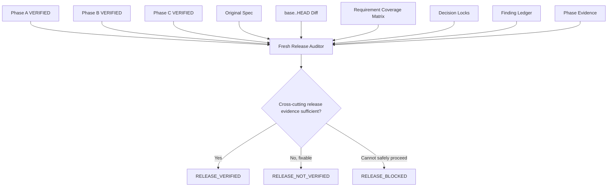

The release auditor receives builder/orchestrator conclusions as claims, not truth.

Its job is specifically to find defects that individual phases can miss.

---

# Risk model

Risk is consequence-based.

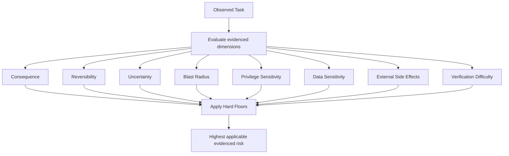

## Hard floors

| Surface                                                                  | Minimum risk |
| ------------------------------------------------------------------------ | -----------: |
| Authentication / authorization / RLS / tenant isolation                  |     **High** |
| Billing / payment / credit / money-moving webhook behavior               |     **High** |
| Production mutation / irreversible external action / credential exposure | **Critical** |
| Schema migration affecting production rows or locking behavior           |     **High** |
| Material shared/public contract change                                   |     **High** |

A tiny patch cannot override a hard floor.

At the same time, hypothetical possibilities are not accumulated merely to inflate risk.

Risk is based on **observed evidence**.

---

# Safety anti-pattern recognition

The system explicitly recognizes recurring engineering failures such as:

| Anti-pattern                      | Why it fails                                                                 |
| --------------------------------- | ---------------------------------------------------------------------------- |
| Client-only authorization         | Hidden UI is not enforcement                                                 |
| Fail-open auth/billing            | Errors must not grant access or money effects                                |
| Production test bypass            | Environment switches are not security boundaries                             |
| Unstable idempotency identity     | Retry-specific keys create duplicate effects                                 |
| Empty-DB migration proof          | Green migration on an empty database does not model existing production rows |
| Secret in diff/log/prompt         | Exposure creates a separate consequential event                              |
| Broad Git clean/reset             | Unknown worktree changes are user-owned                                      |
| “Prepare for production” = deploy | Readiness is not authorization for external mutation                         |

These are investigation leads.

Repository evidence remains authoritative.

---

# Debugging model

Debugging follows falsifiable hypotheses rather than patch iteration.


Repeated equivalent failure forces strategy change.

A third equivalent failure requires explicit failure classification before continuing.

Typical classes include:

```text
implementation defect
broken test oracle
environment/tooling
dependency/external service
permission/authorization
timing/flakiness
missing prerequisite
stale generated artifact
migration/state mismatch
scope conflict
unknown
```

---

# Evidence-first repository investigation

The system begins with the cheapest useful evidence.

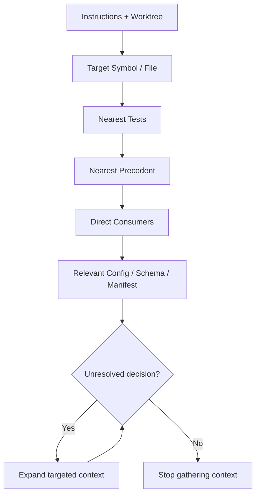

The central stop rule is:

> **Before loading another broad surface, identify which unresolved engineering decision the additional evidence can change. If none exists, stop.**

---

# Evidence Ledger

For Moderate+ investigation or competing hypotheses, a canonical ledger may be used:

| ID      | Hypothesis / Requirement     | Evidence                     | Confidence | Open question            | Affected surface | Planned proof  |
| ------- | ---------------------------- | ---------------------------- | ---------- | ------------------------ | ---------------- | -------------- |
| `E-001` | Request identity is unstable | `request.ts:42`, replay test | high       | provider retry behavior? | billing state    | replay fixture |

Fast-Exit does not create a ledger by default.

---

# Evidence model

`engineering-core` deliberately separates five levels of confidence.

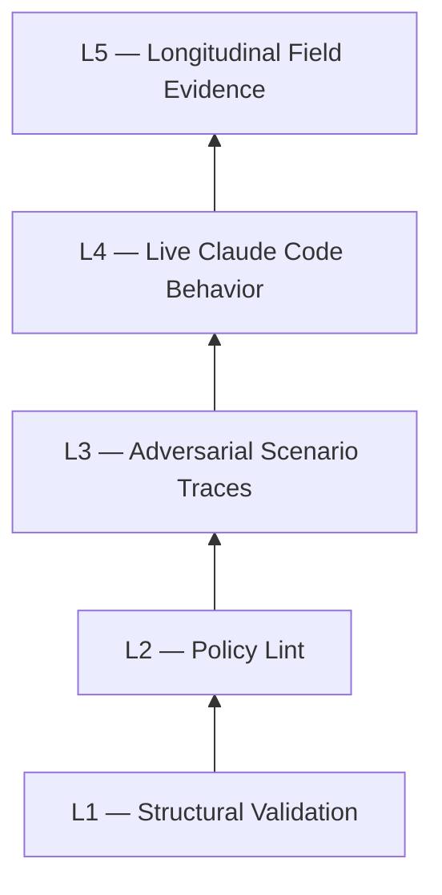

A lower level never claims a higher-level guarantee.

| Level  | Proves                                                 |
| ------ | ------------------------------------------------------ |
| **L1** | package/tree/link/frontmatter structure                |
| **L2** | statically observable policy properties                |
| **L3** | expected reasoning under adversarial scenarios         |
| **L4** | actual Claude Code behavior in disposable repositories |
| **L5** | sustained behavior across real-world workloads         |

---

# Current measured evidence

The repository records live evaluation evidence rather than treating a green static validator as behavioral proof.

## Natural activation — sealed holdout

The current sealed holdout was frozen before scoring.

### Sonnet

| Metric            |                Result |
| ----------------- | --------------------: |
| Positive prompts  |                    32 |
| Negative prompts  |                    22 |
| Ambiguous prompts | 12, scored separately |
| True positives    |                    27 |
| False positives   |                     0 |
| True negatives    |                    22 |
| False negatives   |                     5 |
| **Precision**     |            **1.0000** |
| **Recall**        |            **0.8438** |

Only **Tier-A actual `Skill` invocation traces** count toward the confusion matrix.

Named output or behavior resemblance cannot inflate activation precision/recall.

### Known limitation

Natural activation is model-dependent.

The same sealed holdout produced substantially weaker recall on Haiku.

That difference is retained as evidence rather than hidden through averaging.

---

# Formal Spec Team Mode — live L4 evidence

The Team Mode harness uses disposable Git repositories, bounded cost/time, protected-file checks, independent fixture tests, Git state inspection, and machine scoring.

| Scenario                  | Final status | Key evidence                                                                                        |
| ------------------------- | ------------ | --------------------------------------------------------------------------------------------------- |
| **Large specification**   | **PASS**     | 18 requirements, five phases, locks, deferral, dirty user file, independent QA, fresh release audit |
| **Requirement change**    | **PASS**     | selective `STALE` invalidation; unaffected phase preserved                                          |
| **Cross-session resume**  | **PASS**     | two processes; state revalidated before continuation                                                |
| **Two-Key closure**       | **PASS**     | builder stopped at `IMPLEMENTED`; independent QA supplied second key                                |
| **Fresh release auditor** | **PASS**     | seeded producer/consumer mismatch prevented premature release closure                               |

Failed historical evaluation attempts are intentionally retained where they exposed:

```text
model-policy failures
scorer defects
parser defects
incomplete evidence
```

They are not rewritten into PASS.

---

# Current static validation evidence

Current repository validation includes:

```text
runtime exact-tree validation
frontmatter validation
local link validation
policy-ID ownership
stdlib-only runtime validation scripts
mutation tests
completion-contract tests
L4 scorer tests
activation harness tests
Formal Spec Team Mode harness tests
Python compilation
repository hygiene validation
```

Hosted CI currently covers:

```text
Ubuntu + Python 3.10
Ubuntu + Python 3.14
Windows + Python 3.10
Windows + Python 3.14
```

---

# System boundaries

`engineering-core` deliberately keeps four responsibilities separate.

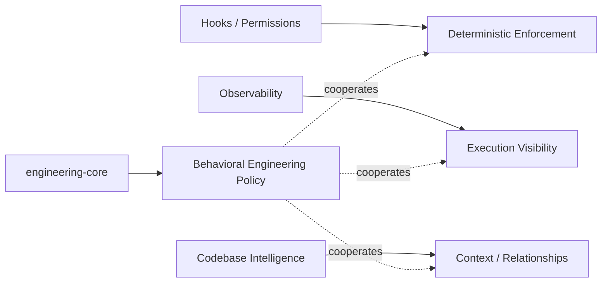

Therefore:

```text
Skill                  = behavioral engineering policy
Hooks / permissions    = deterministic enforcement
Observability          = visibility
Codebase intelligence  = context provider
Specialist skills      = domain mechanics
```

No layer is allowed to pretend to be another.

---

# Optional codebase intelligence

When already available or explicitly requested, `engineering-core` can cooperate with systems such as:

```text
CodeGraph
Cartographer
Graphify
language servers
repository indexes
```

They help locate evidence.

They are not unquestioned sources of truth.

```mermaid
flowchart LR
    TOOL[Optional Graph / Index] --> LEAD[Evidence Lead]
    LEAD --> SRC[Current Source / Config / Tests / Runtime]
    SRC --> DECISION[Engineering Decision]
```

If a provider is absent or stale, native repository investigation continues.

No provider is automatically installed.

---

# Formal specification state model

Requirement states:

```mermaid
stateDiagram-v2
    [*] --> NOT_STARTED
    NOT_STARTED --> READY
    READY --> IN_PROGRESS
    IN_PROGRESS --> IMPLEMENTED
    IMPLEMENTED --> VERIFIED

    VERIFIED --> STALE: changed requirement / new evidence
    STALE --> READY

    IN_PROGRESS --> BLOCKED
    BLOCKED --> READY

    NOT_STARTED --> DEFERRED
    NOT_STARTED --> NOT_APPLICABLE
```

`IMPLEMENTED` and `VERIFIED` are intentionally different states.

---

# Completion contract

Every substantive execution ends with a controlled summary.

For a Low-risk change:

```text
### Execution Summary
Policy: engineering-core
Risk: Low
Status: VERIFIED
Changed: Corrected the local parsing guard.
Verified: Focused parser test passed after the final edit.
Limitations: None
```

Controlled risk values:

```text
Low
Moderate
High
Critical
```

Controlled status values:

```text
NO_CHANGE
IMPLEMENTED
VERIFIED
NOT_VERIFIED
BLOCKED
```

A required failing check can never coexist with `VERIFIED`.

---

# Before and after

| Without a disciplined engineering policy             | With `engineering-core`                                                    |
| ---------------------------------------------------- | -------------------------------------------------------------------------- |
| Read plan and immediately start coding               | Compile the specification first when complexity warrants it                |
| Patch size influences perceived risk                 | Consequence and trust boundaries control risk                              |
| Builder validates itself                             | Independent QA provides separate evidence                                  |
| Tests pass → “done”                                  | Implementation, phase verification, and release verification stay distinct |
| New requirement destabilizes the entire plan         | Only impacted work/evidence becomes `STALE`                                |
| Session restart trusts old notes                     | Repository/spec/state are revalidated before continuation                  |
| Multi-agent means more agents                        | Delegation is bounded by ownership and dependency                          |
| Findings disappear in discussion                     | Finding Ledger requires explicit evidence-backed disposition               |
| Every formal file triggers heavyweight orchestration | Team Mode activates only when coordination value exists                    |
| Every tiny task gets process overhead                | Adaptive Fast-Exit keeps genuine Low-risk work cheap                       |

---

# Repository architecture

```text
.
├── README.md
├── LICENSE
├── .gitignore
├── implementation.md
│
├── .github/
│   └── workflows/
│       └── validate.yml
│
├── docs/
│   ├── claude-router.md
│   ├── deterministic-enforcement.md
│   └── l4-evaluation.md
│
├── evals/
│   ├── README.md
│   │
│   ├── activation/
│   │   ├── README.md
│   │   ├── positive.json
│   │   ├── negative.json
│   │   ├── ambiguous.json
│   │   ├── holdout-positive.json
│   │   ├── holdout-negative.json
│   │   ├── holdout-ambiguous.json
│   │   ├── dataset-metadata.json
│   │   ├── run_activation_eval.py
│   │   └── test_activation_eval.py
│   │
│   ├── formal-spec-team/
│   │   ├── README.md
│   │   ├── run_team_eval.py
│   │   ├── test_team_eval.py
│   │   ├── fixtures/
│   │   └── scenarios/
│   │
│   ├── scenarios/
│   ├── completion_summary.py
│   ├── run_l4_eval.py
│   ├── test_completion_summary.py
│   └── test_l4_eval.py
│
├── scripts/
│   └── validate_repository.py
│
└── engineering-core/
    ├── SKILL.md
    │
    ├── examples/
    │   ├── small-fix.md
    │   ├── fast-exit-abort.md
    │   ├── normal-feature.md
    │   ├── high-risk-change.md
    │   ├── removal-task.md
    │   └── large-spec-execution.md
    │
    ├── references/
    │   ├── operating-model.md
    │   ├── formal-spec-team-mode.md
    │   ├── repository-investigation.md
    │   ├── implementation-debugging.md
    │   ├── verification-review.md
    │   ├── safety-profiles.md
    │   ├── collaboration-state.md
    │   ├── integrations.md
    │   ├── source-synthesis.md
    │   └── evaluation-scenarios.md
    │
    └── scripts/
        ├── validate_skill.py
        └── test_validate_skill.py
```

---

# Progressive disclosure

The runtime package intentionally avoids loading its entire engineering handbook for every task.

```mermaid
flowchart TD
    S[SKILL.md<br/>Lean Dispatcher] -->|Risk / planning| O[operating-model.md]
    S -->|Large formal spec| T[formal-spec-team-mode.md]
    S -->|Repository investigation| R[repository-investigation.md]
    S -->|Debugging| D[implementation-debugging.md]
    S -->|Verification / release| V[verification-review.md]
    S -->|Security-sensitive| P[safety-profiles.md]
    S -->|Agents / state / resume| C[collaboration-state.md]
    S -->|Existing integration only| I[integrations.md]
```

The entrypoint stays intentionally small.

Detailed procedures load only when relevant.

---

# Installation

## Personal skill

Clone the repository:

```bash
git clone https://github.com/aydinogluomer-sys/engineering-core.git
```

### macOS / Linux

```bash
mkdir -p ~/.claude/skills
cp -R engineering-core/engineering-core ~/.claude/skills/engineering-core
```

### PowerShell

```powershell
New-Item -ItemType Directory -Force "$HOME\.claude\skills" | Out-Null
Copy-Item -Recurse ".\engineering-core\engineering-core" "$HOME\.claude\skills\engineering-core"
```

Restart Claude Code if required.

---

## Project-scoped installation

Copy the inner package to:

```text
<project>/.claude/skills/engineering-core/
```

The installed runtime package contains:

```text
SKILL.md
examples/
references/
scripts/
```

The root `evals/`, `docs/`, and repository-maintenance files are not part of the installed runtime skill.

---

# Usage

The skill is model-invocable.

Typical requests:

```text
Fix this race condition.

Implement this feature and verify the affected contracts.

Remove this legacy integration completely.

Review and fix this authorization flow.

Execute this implementation.md phase by phase.

Harden this payment webhook against duplicate delivery.

Prepare this branch for release. Do not deploy.
```

For critical formal-spec work, explicit invocation removes routing ambiguity:

```text
/engineering-core

Execute this implementation.md using Formal Spec Team Mode.
Preserve Decision Locks, use independent QA, and do not claim
RELEASE_VERIFIED without the fresh release audit.
```

---

# Optional project routing

Natural skill activation is model-driven and therefore not deterministic.

Projects that want stronger routing guidance can use the optional pattern documented in:

[`docs/claude-router.md`](docs/claude-router.md)

The router is guidance.

It is not an enforcement mechanism.

---

# Validate the package

From the repository root:

```bash
python engineering-core/scripts/validate_skill.py engineering-core
python engineering-core/scripts/test_validate_skill.py
python evals/test_completion_summary.py
python evals/test_l4_eval.py
python evals/activation/test_activation_eval.py
python evals/formal-spec-team/test_team_eval.py
python scripts/validate_repository.py .
```

Compile validation tooling:

```bash
python -m py_compile \
  engineering-core/scripts/validate_skill.py \
  engineering-core/scripts/test_validate_skill.py \
  scripts/validate_repository.py \
  evals/completion_summary.py \
  evals/test_completion_summary.py \
  evals/run_l4_eval.py \
  evals/test_l4_eval.py \
  evals/activation/run_activation_eval.py \
  evals/activation/test_activation_eval.py \
  evals/formal-spec-team/run_team_eval.py \
  evals/formal-spec-team/test_team_eval.py
```

Static validation proves only what is statically observable.

It does not prove:

```text
natural activation
security correctness
correct root-cause discovery
absence of scope creep
release readiness
```

Those require stronger evidence.

---

# Live L4 evaluation

Live evaluation is manual because it invokes Claude Code and has model/time/cost implications.

## Core behavioral evaluation

```bash
python evals/run_l4_eval.py \
  --case small \
  --model haiku \
  --per-case-budget 0.35 \
  --total-budget 0.35
```

## Natural activation

```bash
python evals/activation/run_activation_eval.py \
  --mode natural \
  --profile full \
  --model sonnet
```

## Formal Spec Team Mode

Start with a bounded scenario:

```bash
python evals/formal-spec-team/run_team_eval.py \
  --case two-key-closure \
  --model sonnet \
  --per-process-budget 0.60
```

Run the complete Team Mode suite only after the harness/scorer is known to be healthy.

---

# Design principles

The project is intentionally opinionated about several boundaries:

```text
Small diff does not mean small risk.

More agents do not mean better engineering.

A builder's PASS is not independent evidence.

A green phase is not a green release.

Old evidence is not current evidence after relevant change.

A graph is not source truth.

A prompt is not deterministic enforcement.

A formal document is not automatically a reason for heavyweight orchestration.

The original specification remains authoritative over derived summaries.
```

---

# What engineering-core is not

It is not a:

```text
security sandbox
destructive-command blocker
mandatory multi-agent framework
code graph
security scanner
deployment tool
replacement for specialist domain expertise
requirement to create planning files for trivial work
```

Its role is narrower and more fundamental:

> **risk + evidence + scope + orchestration + implementation discipline + verification + review + completion semantics**

---

# Current maturity

The current repository has evidence for a mature engineering orchestration architecture:

```text
Lean three-mode runtime dispatcher
Structural policy contract
113 adversarial L3 scenarios
Live explicit L4 behavior
Sealed Tier-A natural-activation evaluation
18-requirement / five-phase Team Mode evaluation
Mid-execution requirement-change evaluation
Cross-session resume evaluation
Two-Key closure evaluation
Fresh release-auditor evaluation
Linux + Windows hosted CI
```

The project deliberately does **not** claim L5.

Longitudinal real-project evidence remains a separate maturity layer.

---

# Design influences

`engineering-core` synthesizes and adapts engineering ideas from:

```text
Official Claude Code guidance
Superpowers
gstack
Trail of Bits skills
Safety Net / destructive-command guard concepts
Claude Code Hooks Mastery
Multi-Agent Observability
CodeGraph
Cartographer
Graphify
ClaudeKit
Alireza Claude Skills
```

The project does not clone these systems.

It uses them as design inputs while maintaining a separate architectural boundary between:

```text
behavioral workflow
deterministic enforcement
observability
codebase intelligence
specialist knowledge
```

See:

[`engineering-core/references/source-synthesis.md`](engineering-core/references/source-synthesis.md)

---

# Evidence and evaluation history

For the append-only record of:

```text
successful runs
failed runs
scorer defects
parser defects
model limitations
activation measurements
Team Mode L4 results
```

see:

[`docs/l4-evaluation.md`](docs/l4-evaluation.md)

The implementation and maturity history is recorded in:

[`implementation.md`](implementation.md)

---

# License

MIT — see [`LICENSE`](LICENSE).
