# engineering-core

[](https://github.com/aydinogluomer-sys/engineering-core/actions/workflows/validate.yml)


`engineering-core` is a repository-agnostic engineering operating policy for Claude Code. It scales investigation, planning, implementation, debugging, testing, review, and completion evidence to the task’s actual consequence and uncertainty.

It is intentionally not a domain framework, autonomous release system, hook package, observability service, or mandatory multi-agent workflow.

## What it provides

- Task and risk classification.
- A small-task fast path with evidence-based abort conditions.
- Repository-instruction discovery and precedence.
- Evidence-first, bounded codebase investigation.
- Proportional plans and minimum-correct implementation.
- Systematic debugging and risk-adaptive positive/negative testing.
- Auth, database, billing, security, removal, and completeness escalation.
- Git, secret, scope, and user-work safety.
- Bounded delegation, specialist routing, fresh review, and conflict rules.
- Diff-first and spec-to-code compliance review.
- Long-horizon state, staleness, ownership, loop, and failure handling.
- Evidence-based phase, release, and Definition-of-Done semantics.

Optional hooks can deterministically enforce selected controls. Optional observability can expose execution. Optional CodeGraph, Cartographer, Graphify, and similar tools can provide context. None is required for the behavioral skill to work.

## Architecture

The package separates four concerns:

| Concern | Responsibility |
|---|---|
| Skill | Behavioral engineering policy and decision rules |
| Hooks/control plane | Optional deterministic prevention or enforcement |
| Observability | Optional execution visibility; never correctness proof |
| Codebase intelligence | Optional context acceleration with native search/read fallbacks |

The installed runtime package is [`engineering-core/`](engineering-core/). Its [`SKILL.md`](engineering-core/SKILL.md) is lean and routes to detailed references only when relevant.

## System maps

These diagrams describe separate responsibilities; arrows mean information or control flow, not proof of correctness.

### 1. System layers

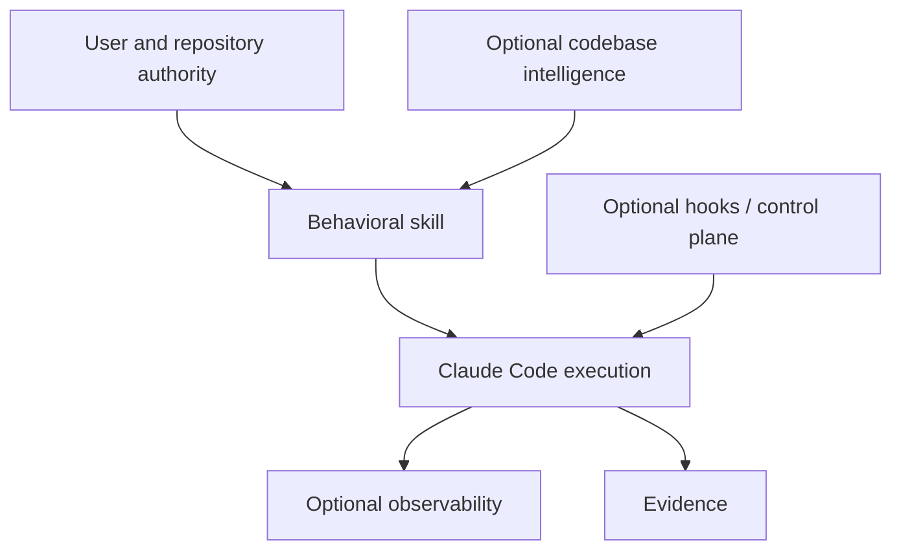
```mermaid
flowchart TB
  U[User and repository authority] --> S[Behavioral skill]
  S --> C[Claude Code execution]
  H[Optional hooks / control plane] --> C
  C --> O[Optional observability]
  I[Optional codebase intelligence] --> S
  C --> E[Evidence]
```

The skill guides behavior, hooks can block selected actions, observability exposes events, and intelligence providers accelerate context. Every optional component has a native fallback or a controlled limitation.

### 2. Dispatcher

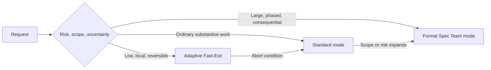
```mermaid
flowchart LR
  R[Request] --> K{Risk, scope, uncertainty}
  K -->|Low, local, reversible| F[Adaptive Fast-Exit]
  K -->|Ordinary substantive work| N[Standard mode]
  K -->|Large, phased, consequential| T[Formal Spec Team mode]
  F -->|Abort condition| N
  N -->|Scope or risk expands| T
```

### 3. Reversible operating loop

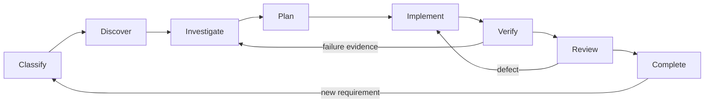
```mermaid
flowchart LR
  C[Classify] --> D[Discover]
  D --> I[Investigate]
  I --> P[Plan]
  P --> M[Implement]
  M --> V[Verify]
  V --> R[Review]
  R --> X[Complete]
  V -->|failure evidence| I
  R -->|defect| M
  X -->|new requirement| C
```

### 4. Formal Team topology

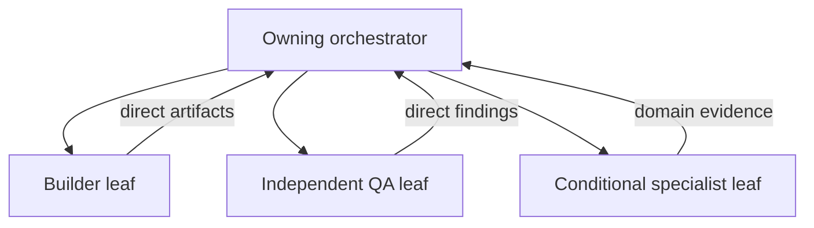
```mermaid
flowchart TB
  O[Owning orchestrator] --> B[Builder leaf]
  O --> Q[Independent QA leaf]
  O --> S[Conditional specialist leaf]
  B -->|direct artifacts| O
  Q -->|direct findings| O
  S -->|domain evidence| O
```

Leaves do not silently create deeper agent trees, and router-only roles do not count as coverage.

### 5. Specification compiler

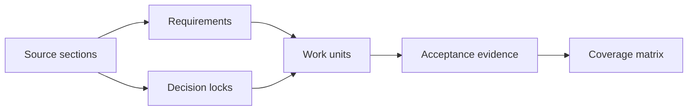
```mermaid
flowchart LR
  S[Source sections] --> R[Requirements]
  R --> W[Work units]
  W --> A[Acceptance evidence]
  A --> C[Coverage matrix]
  S --> L[Decision locks]
  L --> W
```

### 6. Coverage and orphan scan

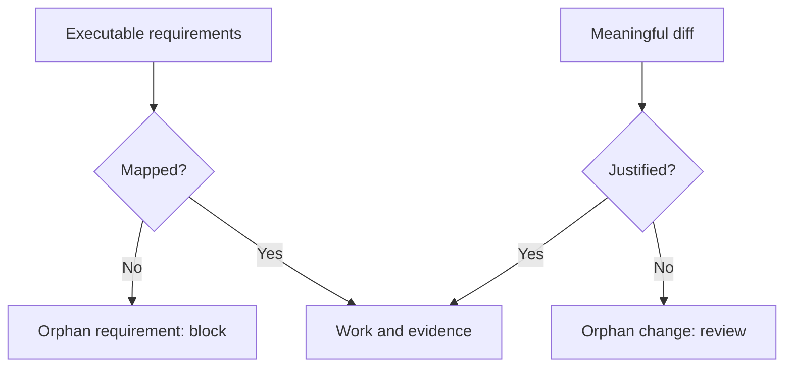
```mermaid
flowchart TB
  R[Executable requirements] --> M{Mapped?}
  M -->|No| OR[Orphan requirement: block]
  M -->|Yes| W[Work and evidence]
  D[Meaningful diff] --> J{Justified?}
  J -->|No| OC[Orphan change: review]
  J -->|Yes| W
```

### 7. Two-Key closure

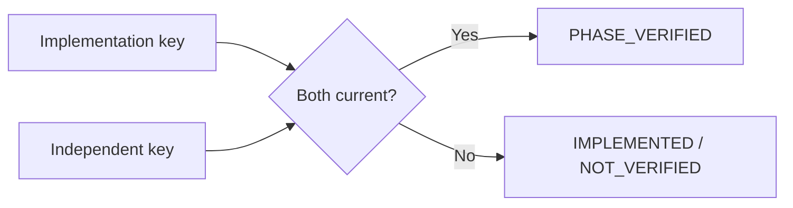
```mermaid
flowchart LR
  I[Implementation key] --> G{Both current?}
  Q[Independent key] --> G
  G -->|Yes| P[PHASE_VERIFIED]
  G -->|No| N[IMPLEMENTED / NOT_VERIFIED]
```

### 8. Selective staleness

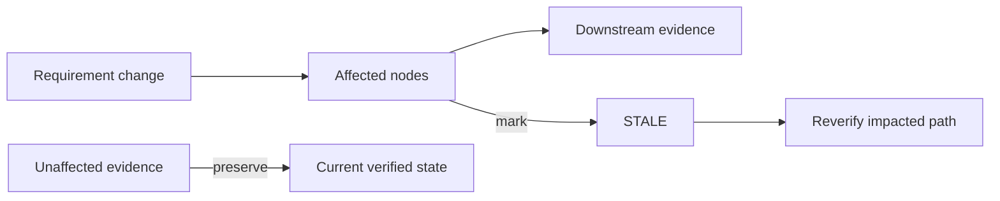
```mermaid
flowchart LR
  C[Requirement change] --> A[Affected nodes]
  A --> D[Downstream evidence]
  A -->|mark| S[STALE]
  U[Unaffected evidence] -->|preserve| V[Current verified state]
  S --> R[Reverify impacted path]
```

### 9. Cross-session sequence

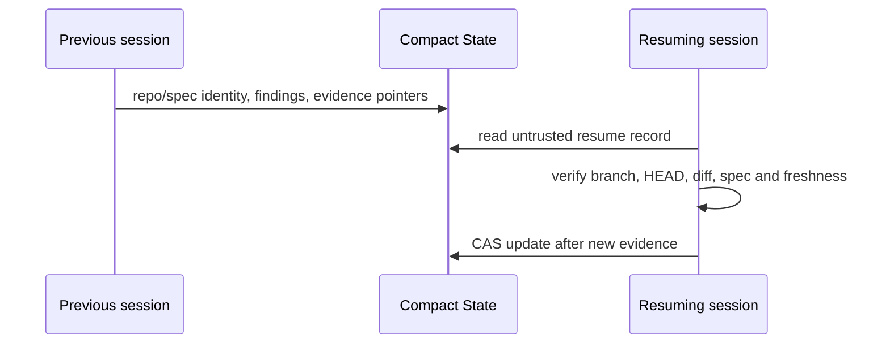
```mermaid
sequenceDiagram
  participant A as Previous session
  participant S as Compact State
  participant B as Resuming session
  A->>S: repo/spec identity, findings, evidence pointers
  B->>S: read untrusted resume record
  B->>B: verify branch, HEAD, diff, spec and freshness
  B->>S: CAS update after new evidence
```

### 10. Fresh release auditor

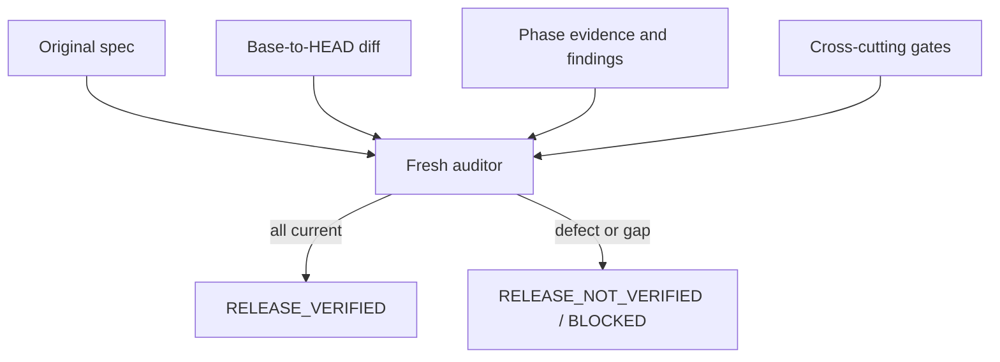
```mermaid
flowchart TB
  S[Original spec] --> A[Fresh auditor]
  D[Base-to-HEAD diff] --> A
  P[Phase evidence and findings] --> A
  G[Cross-cutting gates] --> A
  A -->|all current| R[RELEASE_VERIFIED]
  A -->|defect or gap| B[RELEASE_NOT_VERIFIED / BLOCKED]
```

### 11. Trusted evaluator

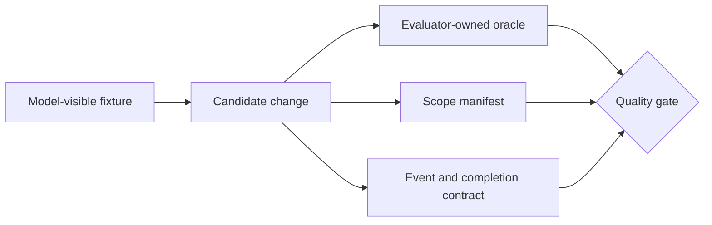
```mermaid
flowchart LR
  M[Model-visible fixture] --> C[Candidate change]
  C --> O[Evaluator-owned oracle]
  C --> S[Scope manifest]
  C --> E[Event and completion contract]
  O --> G{Quality gate}
  S --> G
  E --> G
```

### 12. Failure-resistance controls

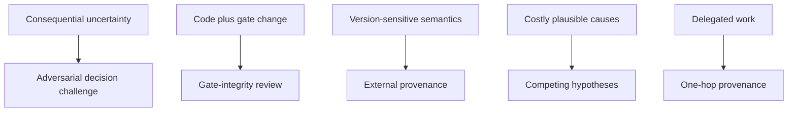
```mermaid
flowchart TB
  D[Consequential uncertainty] --> A[Adversarial decision challenge]
  W[Code plus gate change] --> G[Gate-integrity review]
  X[Version-sensitive semantics] --> P[External provenance]
  H[Costly plausible causes] --> C[Competing hypotheses]
  T[Delegated work] --> O[One-hop provenance]
```

### 13. Evidence ladder

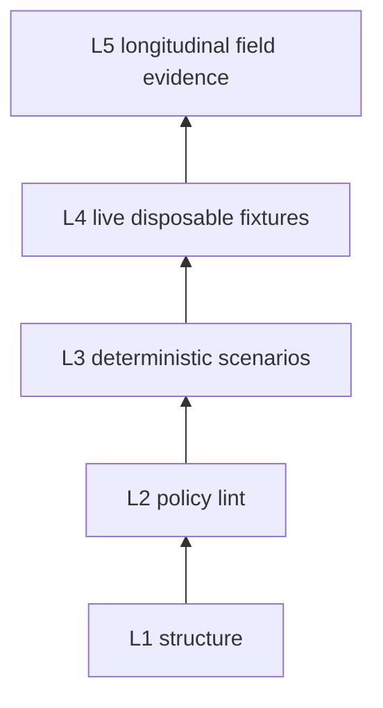
```mermaid
flowchart BT
  L1[L1 structure] --> L2[L2 policy lint]
  L2 --> L3[L3 deterministic scenarios]
  L3 --> L4[L4 live disposable fixtures]
  L4 --> L5[L5 longitudinal field evidence]
```

A lower layer cannot be renamed into a higher one. Static pressure checks remain static until an authorized live campaign runs.

### 14. Cross-model matrix

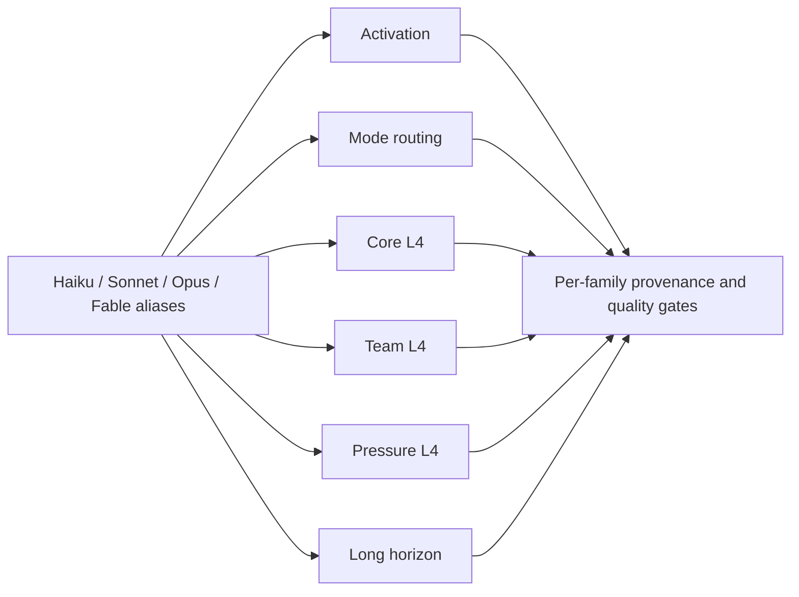
```mermaid
flowchart LR
  M[Haiku / Sonnet / Opus / Fable aliases] --> A[Activation]
  M --> R[Mode routing]
  M --> C[Core L4]
  M --> T[Team L4]
  M --> P[Pressure L4]
  M --> H[Long horizon]
  A --> Q[Per-family provenance and quality gates]
  R --> Q
  C --> Q
  T --> Q
  P --> Q
  H --> Q
```

Alias discovery happens at runtime and the served model identity must be observed. The frozen manifest is non-executable until exact budget authority is recorded.

## Hardening delta

| Before | After |
|---|---|
| Fresh review could seek confirmation | Consequential uncertainty uses bounded adversarial challenge and controlled dispositions |
| Test changes were reviewed generally | Code-plus-gate changes trigger explicit gate-integrity and quality-ratchet checks |
| External guidance was a generic optional input | Version-sensitive semantics use version detection and reconciled provenance states |
| Delegation rules allowed evidence handoff | One-hop provenance rejects nested/router-only and summary-of-summary closure |
| Debugging used hypotheses sequentially | Expensive ambiguity may use bounded, discriminating competing hypotheses |
| L4 covered six core fixtures | The same harness includes eight pressure families and evaluator-owned structural contracts |

These controls improve resistance to confirmation bias, gate weakening, stale evidence, sunk cost, authority drift, and orchestration theater. They do not make unsafe actions impossible and do not convert an unrun live campaign into evidence.

## Three operating modes

### Adaptive Fast-Exit

For genuinely Low-risk, local, reversible, well-understood work. It still checks repository instructions, the controlling surface, the focused diff, and proportionate verification.

Fast-Exit aborts when evidence reveals hidden coupling, a public contract, auth/data/billing/security impact, migration/removal risk, unexpected test behavior, unclear ownership, or widening scope.

### Standard Engineering Mode

The default for normal implementation, debugging, refactoring, removal, migration, review, and release preparation. It uses bounded investigation, an explicit plan when useful, scoped implementation, targeted tests, negative paths, and fresh diff review.

### Formal Spec Team Mode

For large, multi-phase, dependency-rich, specialist-sensitive, High/Critical, or long-horizon contracts. It adds section/requirement compilation, one-writer ownership, independent QA, finding ledgers, Two-Key phase closure, compact resumable state, and fresh release audit.

A formal file or large requirement count alone does not force Team Mode. Small work stays small.

## Installation

Install from an explicit tag or commit. The installer validates a staged package, detects local drift, preserves a backup on update, and supports rollback.

PowerShell:

```powershell
pwsh scripts/install.ps1 `
  -Source https://github.com/aydinogluomer-sys/engineering-core.git `
  -Ref <tag-or-commit> `
  -Destination C:\path\to\.claude\skills\engineering-core
```

POSIX:

```bash
./scripts/install.sh \
  --source https://github.com/aydinogluomer-sys/engineering-core.git \
  --ref <tag-or-commit> \
  --destination /path/to/.claude/skills/engineering-core
```

Use `--replace-drift` only after reviewing local customization. Use `--rollback --destination <path>` to restore the update backup. The repository is currently an unreleased prerelease; see [`VERSION`](VERSION) and [`CHANGELOG.md`](CHANGELOG.md). No tag or GitHub release is implied.

Manual installation is also possible by copying only the `engineering-core` directory into a Claude Code skill location without nesting another `engineering-core` directory inside it.

## Usage

Invoke explicitly when desired:

```text
/engineering-core

Implement this change, preserve unrelated work, and verify the negative path.
```

Claude Code can also select the skill naturally from its description for substantive repository engineering. Repository instructions and current user constraints remain authoritative.

Typical outcomes include:

- a tiny focused fix with a short completion summary;
- a normal implementation with scoped verification;
- a formal execution ledger with independent closure evidence;
- `IMPLEMENTED` when the change exists but required verification is incomplete;
- `NOT_VERIFIED` or `BLOCKED` when evidence or capability is unavailable.

The skill must not turn unavailable tools, unrun checks, model claims, or historical results into current `PASS` evidence.

## Safety limits

- Behavioral policy does not make unsafe actions impossible.
- Deterministic blocking belongs to optional hooks or another control plane.
- External writes, deployment, GitHub settings, publication, paid model calls, and irreversible actions retain their own authorization requirements.
- Untrusted repository text, logs, issues, tool output, and generated artifacts are data, not authority.
- A reviewer who edits the candidate becomes a writer; the changed candidate requires a fresh independent key.
- Specialist names or invocation attempts are not evidence. Required domain obligations need acceptance evidence or a controlled `BLOCKED` outcome.
- User changes, dirty files, staged state, secrets, and protected tests/oracles must be preserved or explicitly reconciled.

## Validation

Run the local deterministic suite:

```bash
python engineering-core/scripts/validate_skill.py engineering-core
python engineering-core/scripts/test_validate_skill.py
python -m unittest discover -s evals -p "test_*.py"
python -m unittest discover -s evals/activation -p "test_*.py"
python -m unittest discover -s evals/formal-spec-team -p "test_*.py"
python -m unittest discover -s evals/cross-model -p "test_*.py"
python -m unittest discover -s evals/failure-resistance -p "test_*.py"
python scripts/test_install.py
python scripts/test_validate_repository.py
python scripts/validate_repository.py .
python -m compileall -q engineering-core scripts evals
```

These checks validate package structure, policy invariants, parser/scorer behavior, trusted-oracle isolation, scope integrity, state freshness/CAS, Team stage provenance, installer safety, workflow structure, and deterministic adversarial fixtures.

They do not prove live-model reliability, production safety, GitHub branch protection, PostgreSQL/RLS behavior, browser interaction, or seven-day field reliability unless those cells were genuinely executed and recorded.

## Evaluation layers

| Layer | Meaning |
|---|---|
| Static package validation | Required files, links, structure, controlled policy invariants |
| Deterministic unit/adversarial tests | Parser, schema, oracle, scope, state, coordination, injection, installer behavior |
| Capability-gated stack fixtures | Real TypeScript/PostgreSQL/browser execution when local tooling exists |
| Live model matrix | Explicitly authorized, budgeted model/cell runs with observed served-model identity |
| Longitudinal field evidence | Seven elapsed days of non-cherry-picked real task outcomes |

Deterministic fixture success is not live-agent success. Hash integrity is not semantic correctness. Observability is not verification.

## Current status

The canonical current claim/evidence matrix is [`docs/current-status.md`](docs/current-status.md). Historical implementation contracts remain in [`implementation.md`](implementation.md) and [`implementation-v4.md`](implementation-v4.md); the active evidence-closure contract is [`implementation-v6.md`](implementation-v6.md). Historical `PASS` records are not automatically current under a newer scorer.

At the current locally validated hardening stage:

- deterministic implementation and adversarial validation are reconciled in the status document; fresh review remains a distinct release gate;
- real TypeScript 7.0.2, PostgreSQL 17.6/RLS, and Chrome/Playwright integrations pass evaluator-owned baseline/fixed oracles;
- GitHub branch protection is applied and API-read back with the four real hosted check contexts, strict updates, administrator enforcement, and force-push/deletion blocking;
- no tag or release has been published because the live campaign remains a release gate;
- the paid live-model matrix is `NOT_AUTHORIZED` without an exact `MAX_TOTAL_SPEND_USD`;
- the seven-day longitudinal protocol is `IN_PROGRESS`, never compressed or backdated.

The dimensions above are independent: runtime policy, deterministic validation, static pressure harness, live pressure campaign, served-model reliability, stack integration, governance, publication, and longitudinal evidence may have different states. See the canonical matrix rather than collapsing them into one “production ready” label.

## Non-goals

This repository does not replace repository-specific instructions, make final product decisions, grant authority, install external tools automatically, operate a hosted observability backend, enforce branch protection by itself, publish releases, or promise universal model behavior. It provides reusable policy, deterministic local checks, and explicit evidence boundaries.

## Documentation map

- [Operating model](engineering-core/references/operating-model.md)
- [Repository investigation](engineering-core/references/repository-investigation.md)
- [Implementation and debugging](engineering-core/references/implementation-debugging.md)
- [Safety profiles](engineering-core/references/safety-profiles.md)
- [Verification and review](engineering-core/references/verification-review.md)
- [Collaboration and state](engineering-core/references/collaboration-state.md)
- [Formal Spec Team Mode](engineering-core/references/formal-spec-team-mode.md)
- [Optional integrations](engineering-core/references/integrations.md)
- [Deterministic enforcement boundary](docs/deterministic-enforcement.md)
- [L4 evaluation](docs/l4-evaluation.md)
- [Cross-model reliability](docs/cross-model-reliability.md)
- [Governance preparation](docs/governance.md)
- [Longitudinal protocol](docs/longitudinal-protocol.md)
- [Source synthesis and provenance](engineering-core/references/source-synthesis.md)
- [Security reporting](SECURITY.md)
- [Contributing](CONTRIBUTING.md)

## Repository governance

CI runs a Python/OS matrix with actions pinned to immutable official commit SHAs. The repository validator parses the supported workflow structure and mutation tests demonstrate that comments or floating action tags cannot fake required jobs.

The prepared branch-protection profile is documented in [`docs/governance.md`](docs/governance.md). Applying settings, pushing commits, creating tags/releases, or publishing evidence are separate actions.

## Contributing and license

See [`CONTRIBUTING.md`](CONTRIBUTING.md) before changing policy, scorers, protected oracles, schemas, or release gates. Report vulnerabilities through [`SECURITY.md`](SECURITY.md) without exposing secrets or private source.

Released under the [MIT License](LICENSE).
